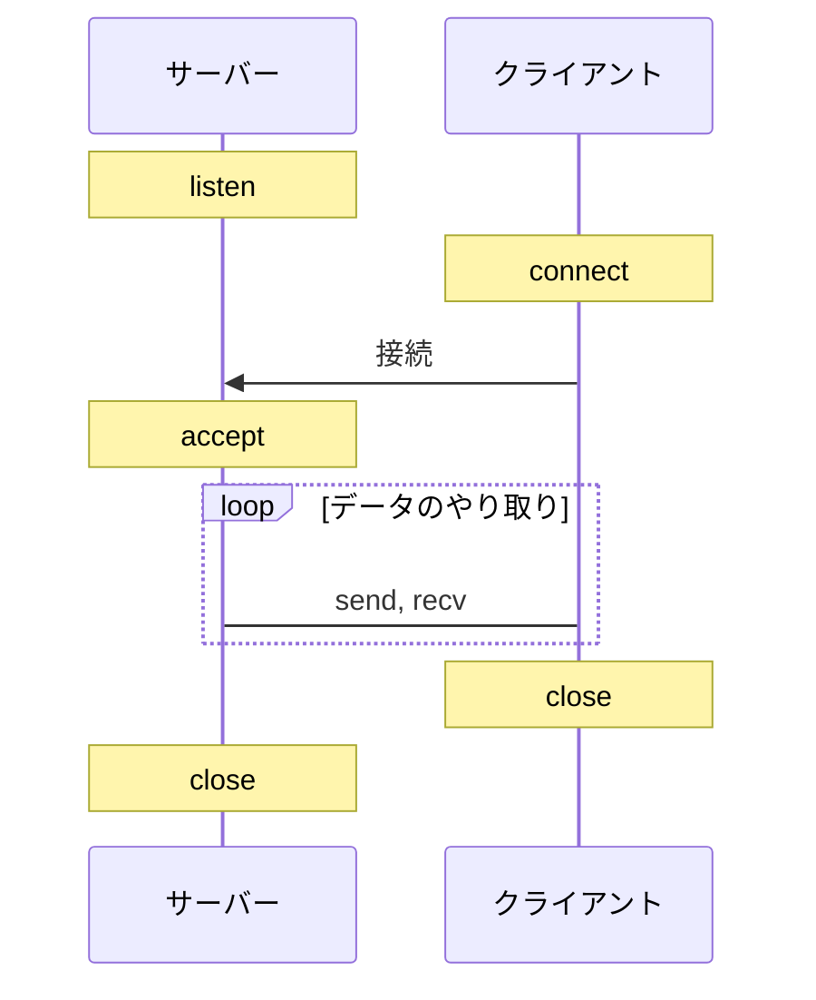

C言語でTCP通信をするにはシステムコールを使用します。
主に、listen, connect, accept, send, recv, close関数を使用します。
send, recvの代わりにwrite, readを使用してソケットからデータを呼んでもよいです。
TCPはコネクション指向性通信のため、最初に接続を確立し、通信が終わったら、ソケットを閉じる必要があります。
これが通信の流れです。



# サーバー

```c
#include <netinet/in.h>
#include <stdio.h>
#include <stdlib.h>
#include <string.h>
#include <sys/socket.h>
#include <sys/types.h>
#include <unistd.h>

#define PORT 8000

int main() {
    int sockfd, new_sockfd;
    socklen_t clilen;
    char buffer[256];
    struct sockaddr_in serv_addr, cli_addr;
    int n;

    // ソケットを作成する
    sockfd = socket(AF_INET, SOCK_STREAM, 0);
    if (sockfd < 0) {
        perror("ERROR opening socket");
        exit(1);
    }

    // ソケットにアドレスを割り当てる
    memset((char *)&serv_addr, 0, sizeof(serv_addr));
    serv_addr.sin_family = AF_INET;
    serv_addr.sin_addr.s_addr = INADDR_ANY;
    serv_addr.sin_port = htons(PORT);
    if (bind(sockfd, (struct sockaddr *)&serv_addr, sizeof(serv_addr)) < 0) {
        perror("ERROR on binding");
        exit(1);
    }

    // クライアントからの接続を待つ
    listen(sockfd, 5);
    clilen = sizeof(cli_addr);
    new_sockfd = accept(sockfd, (struct sockaddr *)&cli_addr, &clilen);
    if (new_sockfd < 0) {
        perror("ERROR on accept");
        exit(1);
    }

    // データを受信する
    memset(buffer, 0, 256);
    n = recv(new_sockfd, buffer, 255, 0);
    if (n < 0) {
        perror("ERROR reading from socket");
        exit(1);
    }

    printf("Message from client: %s\n", buffer);

    // データを送信する
    n = send(new_sockfd, "I got your message", 18, 0);
    if (n < 0) {
        perror("ERROR writing to socket");
        exit(1);
    }

    close(new_sockfd);
    close(sockfd);

    return 0;
}
```

## クライアント

```c
#include <netdb.h>
#include <netinet/in.h>
#include <stdio.h>
#include <stdlib.h>
#include <string.h>
#include <sys/socket.h>
#include <sys/types.h>
#include <unistd.h>

#define PORT 8000

int main(int argc, char *argv[]) {
    int sockfd, n;
    struct sockaddr_in serv_addr;
    struct hostent *server;
    char buffer[256];

    if (argc < 3) {
        fprintf(stderr, "usage %s hostname message\n", argv[0]);
        exit(0);
    }

    // ソケットを作成する
    sockfd = socket(AF_INET, SOCK_STREAM, 0);
    if (sockfd < 0) {
        perror("ERROR opening socket");
        exit(1);
    }

    // サーバーのホスト名を取得する
    server = gethostbyname(argv[1]);
    if (server == NULL) {
        fprintf(stderr, "ERROR, no such host\n");
        exit(0);
    }

    // 接続先アドレスを設定する
    memset((char *)&serv_addr, 0, sizeof(serv_addr));
    serv_addr.sin_family = AF_INET;
    memcpy((char *)&serv_addr.sin_addr.s_addr, (char *)server->h_addr,
           server->h_length);
    serv_addr.sin_port = htons(PORT);

    // サーバーに接続する
    if (connect(sockfd, (struct sockaddr *)&serv_addr, sizeof(serv_addr)) < 0) {
        perror("ERROR connecting");
        exit(1);
    }

    // データを送信する
    memset(buffer, 0, 256);
    strcpy(buffer, argv[2]);
    n = send(sockfd, buffer, strlen(buffer), 0);
    if (n < 0) {
        perror("ERROR writing to socket");
        exit(1);
    }

    // データを受信する
    memset(buffer, 0, 256);
    n = recv(sockfd, buffer, 255, 0);
    if (n < 0) {
        perror("ERROR reading from socket");
        exit(1);
    }

    printf("Message from server: %s\n", buffer);

    close(sockfd);

    return 0;
}
```