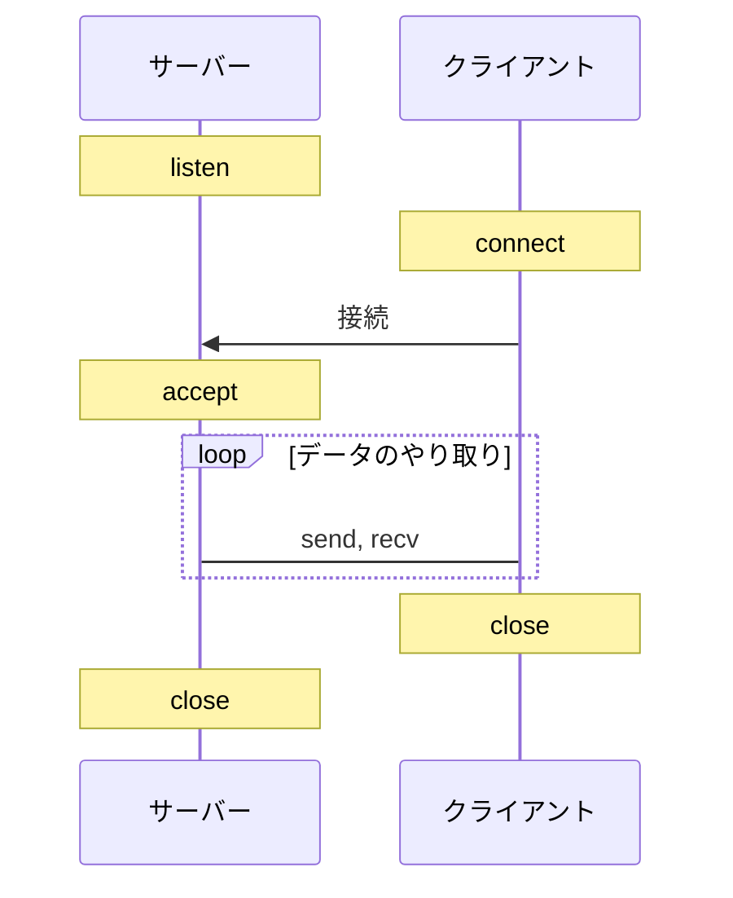

C言語でTCP通信をするにはシステムコールを使用します。主に、listen, connect, accept, send, recv, close関数を使用します。send, recvの代わりにwrite, readを使用してソケットからデータを呼んでもよいです。
また、TCPはコネクション指向性通信のため、最初に接続を確立し、通信が終わったら、ソケットを閉じる必要があります。下図が通信の流れです。



# サーバープログラム
```bash
gcc -o server server.c
./server
```

```c:server.c
#include <netinet/in.h>
#include <stdio.h>
#include <stdlib.h>
#include <string.h>
#include <sys/socket.h>
#include <sys/types.h>
#include <unistd.h>

#define PORT 8000

int main() {
    int sockfd, new_sockfd;
    socklen_t clilen;
    char buffer[256];
    struct sockaddr_in serv_addr, cli_addr;
    int n;

    // ソケットを作成する
    sockfd = socket(AF_INET, SOCK_STREAM, 0);
    if (sockfd < 0) {
        perror("ERROR opening socket");
        exit(1);
    }

    // ソケットにアドレスを割り当てる
    memset((char *)&serv_addr, 0, sizeof(serv_addr));
    serv_addr.sin_family = AF_INET;
    serv_addr.sin_addr.s_addr = INADDR_ANY;
    serv_addr.sin_port = htons(PORT);
    if (bind(sockfd, (struct sockaddr *)&serv_addr, sizeof(serv_addr)) < 0) {
        perror("ERROR on binding");
        exit(1);
    }

    // クライアントからの接続を待つ
    listen(sockfd, 5);
    clilen = sizeof(cli_addr);
    new_sockfd = accept(sockfd, (struct sockaddr *)&cli_addr, &clilen);
    if (new_sockfd < 0) {
        perror("ERROR on accept");
        exit(1);
    }

    // データを受信する
    memset(buffer, 0, 256);
    n = recv(new_sockfd, buffer, 255, 0);
    if (n < 0) {
        perror("ERROR reading from socket");
        exit(1);
    }

    printf("Message from client: %s\n", buffer);

    // データを送信する
    n = send(new_sockfd, "I got your message", 18, 0);
    if (n < 0) {
        perror("ERROR writing to socket");
        exit(1);
    }

    close(new_sockfd);
    close(sockfd);

    return 0;
}
```

## クライアントプログラム

```bash
gcc -o client client.c
./client localhost "Hello, world!"
```

```c:client.c
#include <netdb.h>
#include <netinet/in.h>
#include <stdio.h>
#include <stdlib.h>
#include <string.h>
#include <sys/socket.h>
#include <sys/types.h>
#include <unistd.h>

#define PORT 8000

int main(int argc, char *argv[]) {
    int sockfd, n;
    struct sockaddr_in serv_addr;
    struct hostent *server;
    char buffer[256];

    if (argc < 3) {
        fprintf(stderr, "usage %s hostname message\n", argv[0]);
        exit(0);
    }

    // ソケットを作成する
    sockfd = socket(AF_INET, SOCK_STREAM, 0);
    if (sockfd < 0) {
        perror("ERROR opening socket");
        exit(1);
    }

    // サーバーのホスト名を取得する
    server = gethostbyname(argv[1]);
    if (server == NULL) {
        fprintf(stderr, "ERROR, no such host\n");
        exit(0);
    }

    // 接続先アドレスを設定する
    memset((char *)&serv_addr, 0, sizeof(serv_addr));
    serv_addr.sin_family = AF_INET;
    memcpy((char *)&serv_addr.sin_addr.s_addr, (char *)server->h_addr,
           server->h_length);
    serv_addr.sin_port = htons(PORT);

    // サーバーに接続する
    if (connect(sockfd, (struct sockaddr *)&serv_addr, sizeof(serv_addr)) < 0) {
        perror("ERROR connecting");
        exit(1);
    }

    // データを送信する
    memset(buffer, 0, 256);
    strcpy(buffer, argv[2]);
    n = send(sockfd, buffer, strlen(buffer), 0);
    if (n < 0) {
        perror("ERROR writing to socket");
        exit(1);
    }

    // データを受信する
    memset(buffer, 0, 256);
    n = recv(sockfd, buffer, 255, 0);
    if (n < 0) {
        perror("ERROR reading from socket");
        exit(1);
    }

    printf("Message from server: %s\n", buffer);

    close(sockfd);

    return 0;
}
```

# 各関数の説明
参考：
https://qiita.com/Michinosuke/items/0778a5344bdf81488114
https://qiita.com/0xfffffff7/items/6ffb317df8345070d0b5

## socket
ソケットを作成します。

TCPの場合は、`domain=AF_INET`、`type=SOCK_STREAM`、`protocol=0`を指定します。
UDPの場合は、`domain=AF_INET`、`type=SOCK_DGRAM`、`protocol=0`を指定します。

```c
int socket(int domain, int type, int protocol);
```

## bind
ソケットにアドレスを割り当てます。

addrは、ソケットアドレス構造体のポインタです。

```c
int bind(int sockfd, const struct sockaddr *addr, socklen_t addrlen);
```

## listen
ソケットを接続待ち状態にします。

backlogは、接続待ちの最大数です。

```c
int listen(int sockfd, int backlog);
```

## accept
接続待ち状態のソケットから接続を受け付けます。

addrは、接続元のソケットアドレス構造体が書き込まれるポインタです。

```c
int accept(int sockfd, struct sockaddr *addr, socklen_t *addrlen);
```

## connect
ソケットに接続します。

addrは、接続先のソケットアドレス構造体のポインタです。クライアントプログラムでは、サーバーのアドレスを指定します。

```c
int connect(int sockfd, const struct sockaddr *addr, socklen_t addrlen);
```

## send
ソケットにデータを送信します。

bufに送信したいデータを格納して、lenにデータの長さを指定します。この関数を呼べば、bufのデータがソケットに書き込まれます。
flagsは、送信オプションを指定します。0を指定すると、通常の送信になります。

注意：sendをloopで回して、負荷をかけすぎると、送信失敗が起きますので、注意が必要です。[参考](https://blogs.itmedia.co.jp/komata/2012/12/tcpipsend-4c3a.html) 

```c
ssize_t send(int sockfd, const void *buf, size_t len, int flags);
```

## recv
ソケットからデータを受信します。

bufに受信したデータが格納されます。lenには、bufの長さを指定します。flagsは、受信オプションを指定します。0を指定すると、通常の受信になります。
ただし、文字列を受信したいとき、recvはbufの最後に`\0`を入れてくれないので、事前にbufを初期化しておくか、`buf[len-1] = '\0';`を行う必要があります。

```c
ssize_t recv(int sockfd, void *buf, size_t len, int flags);
```

## gethostbyname
ホスト名からホスト情報を取得します。

```c
struct hostent *gethostbyname(const char *name);
```

## htons
ホストバイトオーダーからネットワークバイトオーダーに変換します。
バイトオーダーは環境によって異なります。例えば、Intel x86 CPUはリトルエンディアンです。

```c
uint16_t htons(uint16_t hostshort);
```
